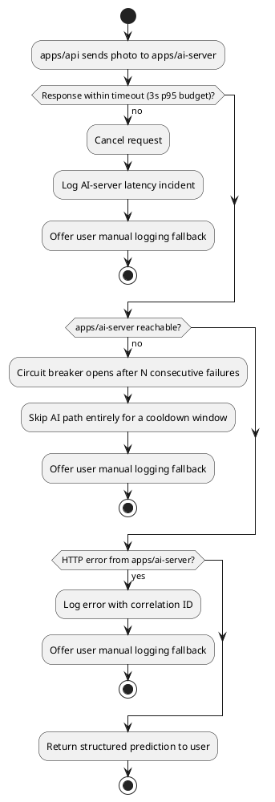

# Activity Diagram: AI Server Failure Handling

Enterprise-grade behavior requires the primary logging path to degrade
gracefully when the AI-detection service is unavailable, slow, or wrong —
see [ADR-0001](../adr/0001-two-server-split.md).

