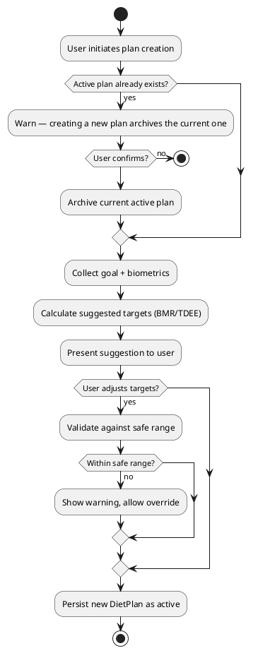

# Activity Diagram: Diet Plan Creation / Replacement

See [Diet plan management use cases](../use-cases/diet-plan-management.md).

```plantuml
@startuml
start
:User initiates plan creation;
if (Active plan already exists?) then (yes)
  :Warn — creating a new plan archives the current one;
  if (User confirms?) then (no)
    stop
  endif
  :Archive current active plan;
endif
:Collect goal + biometrics;
:Calculate suggested targets (BMR/TDEE);
:Present suggestion to user;
if (User adjusts targets?) then (yes)
  :Validate against safe range;
  if (Within safe range?) then (no)
    :Show warning, allow override;
  endif
endif
:Persist new DietPlan as active;
stop
@enduml
```
