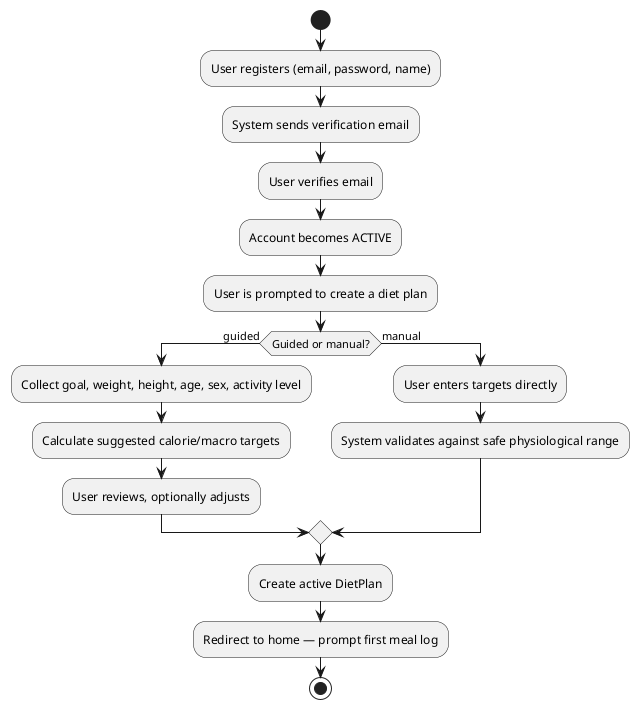

# Activity Diagram: Onboarding

See [UC-01](../use-cases/user-account-management.md#uc-01--register) and
[UC-10](../use-cases/diet-plan-management.md#uc-10--create-diet-plan-guided).

```plantuml
@startuml
start
:User registers (email, password, name);
:System sends verification email;
:User verifies email;
:Account becomes ACTIVE;
:User is prompted to create a diet plan;
if (Guided or manual?) then (guided)
  :Collect goal, weight, height, age, sex, activity level;
  :Calculate suggested calorie/macro targets;
  :User reviews, optionally adjusts;
else (manual)
  :User enters targets directly;
  :System validates against safe physiological range;
endif
:Create active DietPlan;
:Redirect to home — prompt first meal log;
stop
@enduml
```
