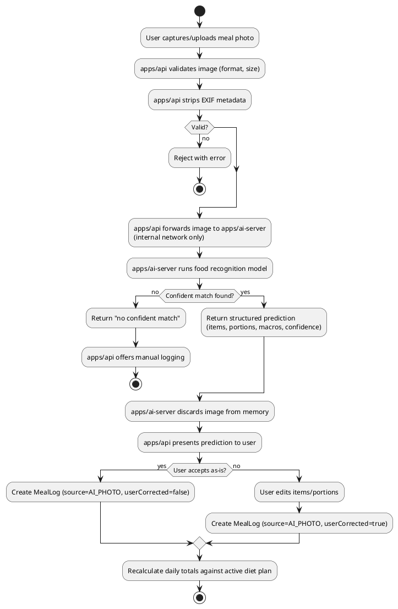

# Activity Diagram: Photo Meal Logging

The central flow of the product — see
[UC-21](../use-cases/meal-logging.md#uc-21--log-meal-via-photo) and
[UC-30](../use-cases/ai-food-detection.md#uc-30--run-food-inference).

