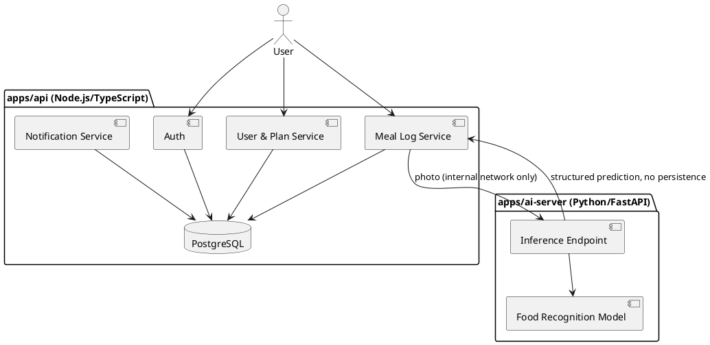
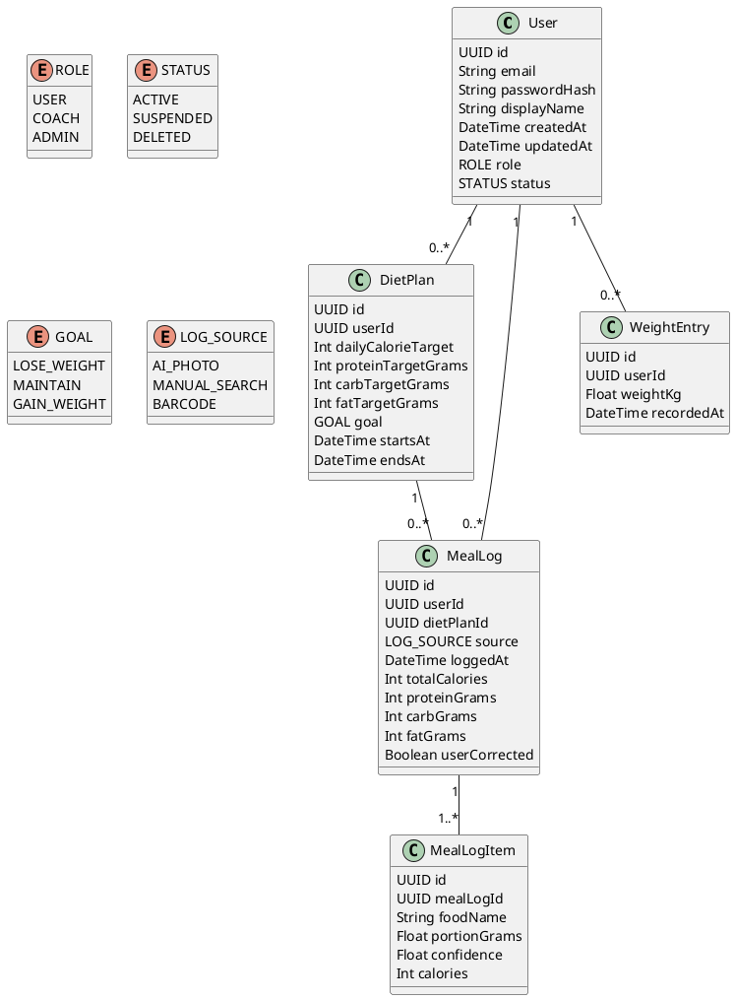

# Application Overview

## Purpose

Nutrilens helps a user follow a diet plan without the friction of manual food
diaries. The core loop: photograph a meal, get an AI-generated estimate of
its contents and macros within seconds, confirm or correct it, and see it
reflected against a personal daily target immediately.

## Key features

- **Diet plans** — a user (optionally with input from a coach/admin) sets
  calorie and macro targets, either manually or via a guided goal wizard
  (lose/maintain/gain weight, activity level, dietary restrictions).
- **Photo-based meal logging** — the centerpiece: a photo is sent to the
  AI-detection service, which returns identified food items, estimated
  portions, and a macro/calorie estimate. The user confirms or edits before
  it's logged.
- **Manual meal logging** — a fallback/alternative path via a searchable food
  database, for when a photo isn't practical or the AI estimate is wrong.
- **Progress tracking** — daily/weekly/monthly trends against targets, weight
  log, adherence streaks.
- **Notifications** — logging reminders, goal-check-ins, streak nudges.

**Later on:**

- **Coach/admin dashboards** — for a nutrition coach managing multiple
  clients' plans.
- **Barcode scanning** — packaged-food lookup as a third logging path.
- **Wearable integration** — activity and weight data from third-party
  devices feeding into the target calculation.

## Architecture

Two independently deployable services, plus a frontend. See
[README.md](../README.md#why-a-two-server-architecture) for the reasoning
behind the split.

### Core domain model

## Related documents

- [Use cases](use-cases/overview.md)
- [Activity diagrams](activity-diagrams/)
- [Requirements](requirements/)
- [Architecture decision records](adr/)
