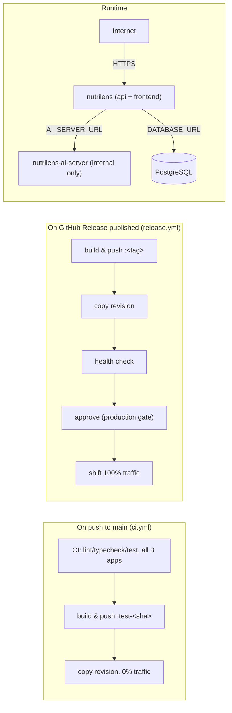

# Deployment

nutrilens is two containers on **Azure Container Apps**: `nutrilens` (the API
server, also serving the built frontend) and `nutrilens-ai-server` (the
food-recognition service, reachable only from inside the Container Apps
environment — no public URL). Each is **one Container App in
multiple-revision mode**, mirroring network-visualizer's setup: production
holds 100% of the traffic, and every push to `main` lands a harmless,
zero-traffic "test" revision alongside it.



## Guides

- **[azure-container-apps.md](./azure-container-apps.md)** — the full
  technical runbook: what's provisioned, GitHub repo configuration, and
  every `az` command for operating the apps directly.

## What "deploying" actually means here

There is no separate staging _application_ to keep in sync with production
— just one app per service, running more than one revision at a time. A
revision is a fully-built, independently-addressable copy of the app; only
its **traffic weight** decides whether real users ever see it.

- **Every push to `main`** builds both images and lands them as a new
  revision at **0% traffic**. Nothing about production changes. The job
  summary on that CI run prints a URL — that's the current `main`, live and
  clickable, before it's anywhere near a release.
- **Publishing a GitHub Release** is the only thing that moves production
  traffic. It builds both images tagged with the release name, rolls
  `nutrilens-ai-server` first (health-checked, then cut over), then
  `nutrilens` (health-checked over its own `/health` endpoint, then cut
  over) — so by the time users see the new api, it's already talking to the
  new ai-server. If a revision never reports healthy, its traffic is never
  touched and production keeps serving what it was already serving.
- **The `production` GitHub environment requires your approval** before that
  traffic shift happens — a deliberate pause between "the new build passed
  its health check" and "real users are on it."

## Cutting a release

1. Make sure `main` is what you want to ship — check the latest `deploy-test`
   job summary if you want to poke at it first.
2. `gh release create v0.0.1 --generate-notes` (or via the GitHub UI).
3. GitHub Actions builds both images, rolls out `nutrilens-ai-server`, then
   `nutrilens` — and pauses at the **production** environment gate. Approve
   it from the Actions run page (or `gh run watch` / the email GitHub sends).
4. Once approved, traffic shifts to the new revisions. The workflow's job
   summary lists both revision names and the production URL.

## Rolling back

Nothing needs rebuilding. Point traffic at the revision that was serving
before:

```bash
az containerapp ingress traffic set -g nutrilens-rg -n nutrilens \
  --revision-weight <previous-revision>=100
az containerapp ingress traffic set -g nutrilens-rg -n nutrilens-ai-server \
  --revision-weight <previous-revision>=100
```

Both workflows keep exactly one prior revision alive as a rollback target
(the one just superseded) — find its name via `az containerapp revision
list -g nutrilens-rg -n nutrilens -o table`, or in the release workflow's
job summary from when it _was_ the production revision.

## Trying `main` before it's a release

Every `deploy-test` run (CI on `main`) prints a URL for the api's test
revision in its job summary — open it, it's a fully working copy of
whatever just merged, backed by the same staging database, at 0% of
production traffic. It scales to zero when nobody's using it.

## One-time setup

Already done for this repo; recorded here for reference (or if the apps
ever need recreating):

- **Repo variables**: `RESOURCE_GROUP`, `ACR_NAME`, `IMAGE_NAME`,
  `CONTAINERAPP_NAME`, `AI_SERVER_IMAGE_NAME`, `AI_SERVER_CONTAINERAPP_NAME`.
- **Repo secrets**: `AZURE_TENANT_ID`, `AZURE_SUBSCRIPTION_ID`,
  `ACR_PUSH_USERNAME`, `ACR_PUSH_PASSWORD`.
- **Environment secrets**: `AZURE_CLIENT_ID` on both `staging` (used by the
  test-revision job) and `production` (used by the release job) — two
  separate Azure AD app registrations, not one shared credential.
- **Environment protection**: `production` has a required reviewer (you);
  `staging` has none, so `main` deploys its test revision unattended.
- **Revision mode**: both Container Apps are in `--mode multiple`, with
  traffic pinned to an explicit revision (not left tracking
  `latestRevision: true` — see the note in
  [azure-container-apps.md](./azure-container-apps.md#notes) for why that
  matters).

See [azure-container-apps.md](./azure-container-apps.md) for the full
provisioning commands if any of this needs to be rebuilt from scratch.
