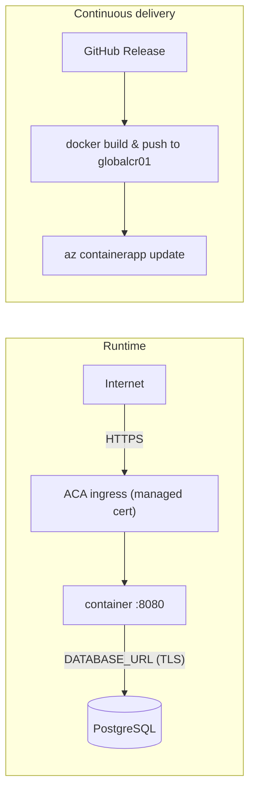

# Deploy to Azure Container Apps (ACA)

The deployment target for nutrilens, mirroring portfolio-webpage and
network-visualizer's setup exactly: a single Container App, images pulled
from the shared **globalcr01** registry (`global-utils` resource group)
rather than a project-owned ACR.

## Architecture

## What's provisioned

| Resource | Name | Notes |
| --- | --- | --- |
| Resource group | `nutrilens-rg` | westeurope |
| Container Apps environment | `nutrilens-env` | westeurope |
| Container App | `nutrilens` | system-assigned identity, `AcrPull` on `globalcr01`, external ingress on port 8080 |
| Azure AD app registration | `gh-nutrilens` | federated credential (OIDC) scoped to the `production` GitHub environment — no stored client secret |

The registry itself (`globalcr01.azurecr.io`, in `global-utils`) and its
`ACR-PUSH` scoped token are **shared** across projects — nutrilens got its
own `password2` credential slot on that same token rather than a new
registry or a rotated `password1`, which portfolio-webpage and
network-visualizer already depend on.

## GitHub repo configuration

Variables (Settings → Secrets and variables → Actions → *Variables*):

| Variable | Value |
| --- | --- |
| `RESOURCE_GROUP` | `nutrilens-rg` |
| `ACR_NAME` | `globalcr01` |
| `CONTAINERAPP_NAME` | `nutrilens` |
| `IMAGE_NAME` | `nutrilens` |

Secrets:

| Secret | Source |
| --- | --- |
| `AZURE_CLIENT_ID` | `gh-nutrilens` app registration's app id |
| `AZURE_TENANT_ID` | `az account show --query tenantId` |
| `AZURE_SUBSCRIPTION_ID` | `az account show --query id` |
| `ACR_PUSH_USERNAME` | `ACR-PUSH` (the shared token's name) |
| `ACR_PUSH_PASSWORD` | that token's `password2` |

## Continuous delivery

[`release.yml`](../../.github/workflows/release.yml): publishing a GitHub
Release builds `apps/api`'s image, pushes it to `globalcr01` using the
scoped push token (no Azure identity needed for that job), then rolls the
Container App onto the new tag via Azure OIDC login — kept in its own job
behind the `production` GitHub environment so a release only ever waits on
one step.

The **first real release is v0.0.1, cut once the M6 production frontend is
live** — the bootstrap image currently running (`nutrilens:bootstrap`, built
by hand via `az acr build`) only serves `apps/api`.

The app is reachable at
`https://nutrilens.nicemoss-805249cc.westeurope.azurecontainerapps.io` — the
bootstrap revision pulled from `globalcr01` correctly via the managed
identity (confirmed in the revision logs) and then failed to start on
`DATABASE_URL is not set`, exactly as expected with no database provisioned
yet. That's the correct state for this pass: the infra (registry pull,
ingress, identity) is proven working end to end; a real database and a real
image are what's still missing before this serves traffic.

## Operations

| Task | Command |
| --- | --- |
| Logs (stream) | `az containerapp logs show -g nutrilens-rg -n nutrilens --follow` |
| Revisions | `az containerapp revision list -g nutrilens-rg -n nutrilens -o table` |
| Update a secret | `az containerapp secret set -g nutrilens-rg -n nutrilens --secrets database-url=…` then update the revision |
| Scale | `az containerapp update -g nutrilens-rg -n nutrilens --min-replicas 0 --max-replicas 5` |
| Rollback | `az containerapp ingress traffic set -g nutrilens-rg -n nutrilens --revision-weight <prev-rev>=100` |

### Notes

- **Database**: not yet provisioned — the Container App has no `DATABASE_URL`
  secret set until a managed Postgres exists. Tracked separately; local/dev
  uses `apps/api/docker-compose.yml`'s throwaway Postgres.
- **Scale-to-zero**: fine for this app (stateless, no background jobs), so
  `--min-replicas 0` is the default rather than `1`.
