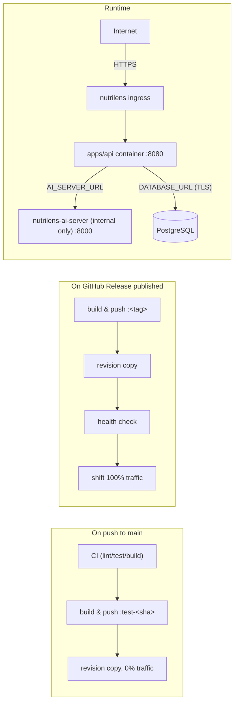

# Deploy to Azure Container Apps (ACA)

The deployment target for nutrilens, mirroring network-visualizer's setup
(`organizational/deploy/azure-container-apps.md` there): images pulled from
the shared **globalcr01** registry (`global-utils` resource group) rather
than a project-owned ACR, and **one Container App per service, each in
multiple-revision mode** — not one App per environment. "Staging" is not a
second copy of the app; it's a revision of the same app that happens to be
holding 0% of the traffic.

- **`nutrilens`** — serves `apps/api` and, via `express.static` + SPA
  fallback, the built `apps/frontend`. External ingress.
- **`nutrilens-ai-server`** — the AI-detection service. `--ingress internal`
  only (ADR-0001/NFR-SEC-01): no public FQDN, reachable only from `nutrilens`
  inside the same Container Apps environment.

## Architecture

Why one app per service instead of one app per environment: a second Container
App per service (the original `nutrilens-staging` / `nutrilens-ai-server-staging`
shape) doubles the infra to reason about for a distinction — "is this the
version people see" — that Container Apps already has a first-class primitive
for: **traffic weight on a revision**. Multiple-revision mode gives every push
its own addressable, fully-built revision without ever letting it near
production traffic, and a release becomes "point the weight at the revision
already proven healthy" instead of a fresh deploy that might fail differently
than the one that was tested.

## What's provisioned

| Resource | Name | Notes |
| --- | --- | --- |
| Resource group | `nutrilens-rg` | westeurope |
| Container Apps environment | `nutrilens-env` | westeurope — shared by both apps |
| Container App | `nutrilens` | system-assigned identity, `AcrPull` on `globalcr01`, external ingress on :8080, multiple-revision mode, max 5 replicas |
| Container App | `nutrilens-ai-server` | system-assigned identity, `AcrPull` on `globalcr01`, **internal** ingress on :8000, multiple-revision mode, max 5 replicas |
| Managed PostgreSQL | one server, two databases/roles (`nutrilens`, `nutrilens_staging`) | Azure Database for PostgreSQL Flexible Server, Burstable tier — a real "staging" database still exists, even though there's no more "staging app"; the *test* revision's `DATABASE_URL` points at `nutrilens_staging` so it never touches production data |
| Azure AD app registration | `gh-nutrilens` | federated credential (OIDC) scoped to the `production` GitHub environment |
| Azure AD app registration | `gh-nutrilens-staging` | federated credential (OIDC) scoped to the `staging` GitHub environment — used by the test-revision job; a genuinely separate identity so a compromised one can't touch the other's deploy path |

Both Azure AD apps are granted `Contributor` scoped to `nutrilens-rg` only
(not the subscription) — that's what lets each mint revisions and shift
traffic on both Container Apps without a broader grant.

The registry itself (`globalcr01.azurecr.io`, in `global-utils`) and its
`ACR-PUSH` scoped token are **shared** across projects, same as
portfolio-webpage and network-visualizer.

## GitHub repo configuration

Repo-level variables:

| Variable | Value |
| --- | --- |
| `RESOURCE_GROUP` | `nutrilens-rg` |
| `ACR_NAME` | `globalcr01` |
| `IMAGE_NAME` | `nutrilens` |
| `CONTAINERAPP_NAME` | `nutrilens` |
| `AI_SERVER_IMAGE_NAME` | `nutrilens-ai-server` |
| `AI_SERVER_CONTAINERAPP_NAME` | `nutrilens-ai-server` |

There is deliberately no per-environment `CONTAINERAPP_NAME` split anymore —
both the test-revision job and the release job target the *same* two apps,
by name.

Repo-level secrets:

| Secret | Source |
| --- | --- |
| `AZURE_TENANT_ID` | `az account show --query tenantId` |
| `AZURE_SUBSCRIPTION_ID` | `az account show --query id` |
| `ACR_PUSH_USERNAME` | `ACR-PUSH` (the shared token's name) |
| `ACR_PUSH_PASSWORD` | that token's `password2` |

**Environment-scoped** (Settings → Environments → *production* / *staging*):

| Name | `production` | `staging` |
| --- | --- | --- |
| `AZURE_CLIENT_ID` (secret) | `gh-nutrilens` app id | `gh-nutrilens-staging` app id |

`production` also carries GitHub's own "required reviewers" gate; `staging`
does not — every push to `main` builds a test revision unattended.

## Continuous delivery

- [`ci.yml`](../../.github/workflows/ci.yml)'s `deploy-test` job: runs after
  every other CI job passes on a push to `main`. Builds both images, landing
  each as a revision named `v<package.json version>-dev-<run number>` (e.g.
  `nutrilens--v0-1-0-dev-132`) — readable in `az containerapp revision list`,
  not a raw commit hash — then for **each** app (`nutrilens-ai-server` first,
  then `nutrilens`): copies a new revision from whichever revision is currently at
  100% traffic, sets `--min-replicas` so it actually runs, waits for it to
  report healthy, and stops — it never calls `az containerapp ingress
  traffic set`. The api test revision gets `AI_SERVER_URL` overridden to the
  ai-server test revision's own FQDN, so a test build never silently talks to
  production's AI server. The job prints the api test revision's URL to the
  workflow summary; that's how you manually try "the current `main`" without
  it being visible to anyone hitting the production URL.
- [`release.yml`](../../.github/workflows/release.yml): publishing a GitHub
  Release builds both images tagged with the release name, then for each app
  copies a new revision from the current 100%-traffic revision, health-checks
  it, and **only then** shifts 100% of traffic onto it — ai-server first, api
  second, so by the time api goes live it's already pointed at the new
  ai-server. A revision that fails to boot or fails its health probe leaves
  production on the old revision untouched; nothing is torn down mid-deploy.

Both jobs cap revision history at 5 (`--max-inactive-revisions`) and
deactivate whatever they superseded, keeping one rollback target per app —
one command away via `az containerapp ingress traffic set --revision-weight
<prev>=100`.

## Operations

| Task | Command |
| --- | --- |
| Logs (stream) | `az containerapp logs show -g nutrilens-rg -n nutrilens --follow` |
| Revisions + traffic | `az containerapp revision list -g nutrilens-rg -n nutrilens -o table` |
| Update a secret | `az containerapp secret set -g nutrilens-rg -n nutrilens --secrets database-url=…` then create/update a revision |
| Scale | `az containerapp update -g nutrilens-rg -n nutrilens --min-replicas 0 --max-replicas 5 --revision-suffix "$(date +v%Y%m%d-%H%M)"` — the suffix is not optional, see below |
| Rollback | `az containerapp ingress traffic set -g nutrilens-rg -n nutrilens --revision-weight <prev-rev>=100` |
| Try the current `main` | grab the URL from the latest `deploy-test` run's job summary, or `az containerapp revision list -g nutrilens-rg -n nutrilens --query "[?starts_with(name,'nutrilens--test-')]"` |

Replace `nutrilens` with `nutrilens-ai-server` for the AI service — its
revision FQDNs only resolve inside `nutrilens-env`, so `logs show` and
`revision list` work from anywhere, but curling its FQDN directly does not.

### Notes

- **Scale-to-zero**: production revisions run `--min-replicas 0` (stateless,
  no background jobs) — the trade is a cold start for the first request after
  idle. Test revisions are pinned to `--min-replicas 1` for the duration they
  exist so a manual test isn't waiting on a cold start on top of everything
  else.
- **Why not delete a superseded revision instead of deactivating it**:
  Container Apps has no delete API for a revision — deactivating is the only
  operation, and it's also what makes rollback a single command rather than a
  redeploy.
- **Traffic must be pinned to an explicit revision name, not left tracking
  `latestRevision: true`**: switching an app to multiple-revision mode does
  not itself pin traffic — `properties.configuration.ingress.traffic` stays
  `[{"latestRevision": true, "weight": 100}]` (Azure's default) until
  something calls `ingress traffic set` with an explicit `--revision-weight`.
  In that default state, "100% traffic" silently tracks *whichever revision
  is newest* — including a zero-traffic "test" revision the moment it's
  created, since it becomes the new `latestRevisionName`. That would defeat
  the entire safety property this setup exists for. Both apps were pinned by
  hand once, right after the `--mode multiple` conversion
  (`az containerapp ingress traffic set --revision-weight <rev>=100`); every
  release afterward keeps it pinned, since it always sets an explicit weight.
  The `deploy-test`/`deploy-to-production` jobs resolve `FROM` defensively
  (falling back to `properties.latestRevisionName` if no revision holds an
  explicit 100% weight) in case this state is ever reached again — e.g. right
  after `az containerapp create`.
- **`az containerapp update --set-env-vars` merges against the *latest*
  revision's template, not the one serving traffic — `az containerapp
  revision copy --from-revision <100%-traffic-revision>` is the safe one for
  a manual production change.** `deploy-test` runs on every push to `main`
  and creates a new (0%-traffic) revision each time, which immediately
  becomes `latestRevisionName`. A `containerapp update` run any time after
  that — including a manual fix from a terminal — silently bases its merge
  on that test revision's env vars, not production's. This is exactly how
  `AI_SERVER_URL` on `nutrilens` ended up pointed at a `--dev-NNN` revision's
  own FQDN instead of the stable `nutrilens-ai-server.internal...` hostname:
  nothing ever reset it explicitly, so whatever a test revision happened to
  have inherited kept propagating forward. Fixed two ways — `release.yml`'s
  api rollout now sets `AI_SERVER_URL` explicitly every release (queried
  fresh from ai-server's own stable ingress FQDN, never inherited), and any
  future manual env-var fix should use `revision copy --from-revision
  <100%-traffic-revision>` (see `release.yml`'s `$FROM` resolution for how
  to find it), not a bare `containerapp update`.
- **A bare `az containerapp update` auto-names the revision.** Any update
  that touches the template — image, env vars, scale — creates a revision,
  and without `--revision-suffix` Azure names it `nutrilens--0000008`.
  Three of those (`--0000006/7/8`) were created by hand on 2026-08-11 from
  the Scale row above, which is why that row now carries a suffix. The
  workflows always pass one; hand-run commands must too, or the revision
  list stops telling you which version is deployed.

## apps/ai-server network isolation

- **`--ingress internal`**, not `external` — no public FQDN at all, not
  merely an unauthenticated one. Only `nutrilens` (same `nutrilens-env`
  Container Apps environment) can reach it.
- Same registry-pull pattern as `nutrilens`: a system-assigned identity
  granted `AcrPull` on `globalcr01`, nothing else.
- `apps/api`'s `AI_SERVER_URL` points at `nutrilens-ai-server`'s stable
  app-level ingress FQDN (`https://nutrilens-ai-server.internal.<env-domain>`)
  in production — Azure resolves that to whichever revision currently holds
  the traffic weight, so a production api revision never needs to know
  ai-server's revision name. A *test* api revision overrides this to point at
  ai-server's specific test revision instead (see Continuous delivery above),
  so it never falls back to hitting the production AI server.

Locally, `docker-compose.yml`'s `ai-server` service already follows the same
principle (`expose:`, not `ports:` — no host binding at all). This is "make
the cloud match the local topology that already exists," not a new policy.
