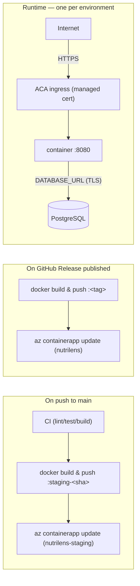

# Deploy to Azure Container Apps (ACA)

The deployment target for nutrilens, mirroring portfolio-webpage and
network-visualizer's setup: Container Apps, images pulled from the shared
**globalcr01** registry (`global-utils` resource group) rather than a
project-owned ACR. **Two environments** (GitLab-flow-style), each with its
own Azure Container App and its own Azure AD identity — not two copies of
the same credential:

- **staging** — auto-deploys on every merge to `main`. Nothing to approve;
  this is where "does the latest `main` actually work" gets answered before
  it becomes a release.
- **production** — deploys only when a GitHub Release is published (a
  deliberate act, tagging a specific commit as `vX.Y.Z`), never on a bare
  push. See [Continuous delivery](#continuous-delivery).

## Architecture

## What's provisioned

| Resource | Name | Notes |
| --- | --- | --- |
| Resource group | `nutrilens-rg` | westeurope — shared by both environments |
| Container Apps environment | `nutrilens-env` | westeurope — shared by both environments |
| Container App (production) | `nutrilens` | system-assigned identity, `AcrPull` on `globalcr01`, external ingress on :8080, max 5 replicas |
| Container App (staging) | `nutrilens-staging` | same shape, its own system-assigned identity, max 3 replicas (lower ceiling — staging doesn't need production's headroom) |
| Azure AD app registration (production) | `gh-nutrilens` | federated credential (OIDC) scoped to the `production` GitHub environment |
| Azure AD app registration (staging) | `gh-nutrilens-staging` | federated credential (OIDC) scoped to the `staging` GitHub environment — a genuinely separate identity, not a shared one, so a compromised staging credential can't touch production |

Both Container Apps' managed identities are granted `AcrPull` on
`globalcr01` individually (least-privilege — neither can do anything to the
other's resources), and both Azure AD apps are granted `Contributor` scoped
to `nutrilens-rg` only (not the subscription).

The registry itself (`globalcr01.azurecr.io`, in `global-utils`) and its
`ACR-PUSH` scoped token are **shared** across projects — nutrilens got its
own `password2` credential slot on that same token rather than a new
registry or a rotated `password1`, which portfolio-webpage and
network-visualizer already depend on. Both environments push through the
same token (pushing an image isn't environment-specific; only the deploy
step is).

## GitHub repo configuration

Repo-level variables (shared, same for both environments):

| Variable | Value |
| --- | --- |
| `RESOURCE_GROUP` | `nutrilens-rg` |
| `ACR_NAME` | `globalcr01` |
| `IMAGE_NAME` | `nutrilens` |

Repo-level secrets (shared):

| Secret | Source |
| --- | --- |
| `AZURE_TENANT_ID` | `az account show --query tenantId` |
| `AZURE_SUBSCRIPTION_ID` | `az account show --query id` |
| `ACR_PUSH_USERNAME` | `ACR-PUSH` (the shared token's name) |
| `ACR_PUSH_PASSWORD` | that token's `password2` |

**Environment-scoped** (Settings → Environments → *production* / *staging*)
— deliberately not repo-level, since the whole point is that these differ:

| Name | `production` | `staging` |
| --- | --- | --- |
| `CONTAINERAPP_NAME` (var) | `nutrilens` | `nutrilens-staging` |
| `AZURE_CLIENT_ID` (secret) | `gh-nutrilens` app id | `gh-nutrilens-staging` app id |

## Continuous delivery

- [`ci.yml`](../../.github/workflows/ci.yml)'s `deploy-staging` job: runs
  after every other CI job passes on a push to `main`, builds `apps/api`'s
  image tagged `staging-<sha>`, pushes it to `globalcr01`, and rolls
  `nutrilens-staging` onto it via the `staging` environment's OIDC login.
  No approval gate — that's the point of a staging environment.
- [`release.yml`](../../.github/workflows/release.yml): publishing a GitHub
  Release builds `apps/api`'s image tagged with the release name, pushes it,
  then rolls `nutrilens` (production) onto it via the `production`
  environment's OIDC login. Never runs on a bare push.

The **first real release is v0.0.1, cut once the M6 production frontend is
live** — both Container Apps currently run the bootstrap image
(`nutrilens:bootstrap`, built by hand via `az acr build`), which only serves
`apps/api` and has no `DATABASE_URL` set, so neither actually serves
traffic yet. That's the correct state for this pass: the infra (registry
pull, ingress, both identities, both environments) is proven working end to
end for both Container Apps; a real database and a real image are what's
still missing before either serves traffic.

## Operations

Replace `nutrilens` with `nutrilens-staging` for the staging environment.

| Task | Command |
| --- | --- |
| Logs (stream) | `az containerapp logs show -g nutrilens-rg -n nutrilens --follow` |
| Revisions | `az containerapp revision list -g nutrilens-rg -n nutrilens -o table` |
| Update a secret | `az containerapp secret set -g nutrilens-rg -n nutrilens --secrets database-url=…` then update the revision |
| Scale | `az containerapp update -g nutrilens-rg -n nutrilens --min-replicas 0 --max-replicas 5` |
| Rollback | `az containerapp ingress traffic set -g nutrilens-rg -n nutrilens --revision-weight <prev-rev>=100` |

### Notes

- **Database**: not yet provisioned for either environment — neither
  Container App has a `DATABASE_URL` secret set until a managed Postgres
  exists (likely one per environment, once that lands). Local/dev uses
  `apps/api/docker-compose.yml`'s throwaway Postgres.
- **Scale-to-zero**: fine for this app (stateless, no background jobs), so
  `--min-replicas 0` is the default rather than `1`.

## apps/ai-server network isolation

Not yet deployed to Azure (no Container App provisioned for it yet — the
actual provisioning is its own follow-up issue). This section documents the
policy it must be provisioned under, per ADR-0001 and NFR-SEC-01, so that
work has a spec to build against rather than a decision made ad hoc at
provisioning time:

- **`--ingress internal`**, not `external` — the Container Apps environment
  provides a VNet-internal-only ingress mode. Only other apps inside the
  same `nutrilens-env` Container Apps environment (i.e. `nutrilens` /
  `nutrilens-staging`) can reach it; there is no public FQDN at all, not
  merely an unauthenticated one.
- Same registry-pull pattern as `nutrilens`/`nutrilens-staging`: a
  system-assigned identity granted `AcrPull` on `globalcr01`, nothing else.
- `apps/api`'s `AI_SERVER_URL` points at the Container App's
  environment-internal DNS name (`https://<app>.internal.<env-domain>`),
  the Azure equivalent of `docker-compose.yml`'s `http://ai-server:8000` —
  same isolation property, different mechanism.
- One `nutrilens-ai-server`-shaped Container App per environment (staging,
  production), matching the `nutrilens`/`nutrilens-staging` split — a
  staging `apps/api` must not be able to silently fall back to hitting
  production's AI server or vice versa.

Locally, `docker-compose.yml`'s `ai-server` service already follows the
same principle today (`expose:`, not `ports:` — no host binding at all,
verified live). So this is "make the cloud match the local topology that
already exists," not a new policy invented here.
