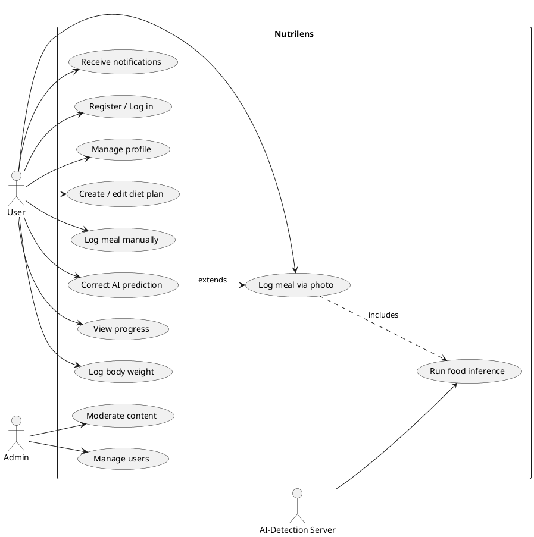

# Use Case Overview

## Actors

| Actor | Description |
| --- | --- |
| **User** | A person tracking their diet. Primary actor for nearly all use cases. |
| **Coach** *(later)* | A nutrition coach managing plans for multiple users. |
| **Admin** | Operates the platform: user management, moderation, system health. |
| **AI-Detection Server** | System actor — receives a photo, returns a structured prediction. Never initiates contact with a user directly. |

## Use case diagram

## Use case index

- [User account management](user-account-management.md)
- [Diet plan management](diet-plan-management.md)
- [Meal logging](meal-logging.md)
- [AI food detection](ai-food-detection.md)
- [Progress tracking](progress-tracking.md)
- [Notifications](notifications.md)
- [Admin management](admin-management.md)
